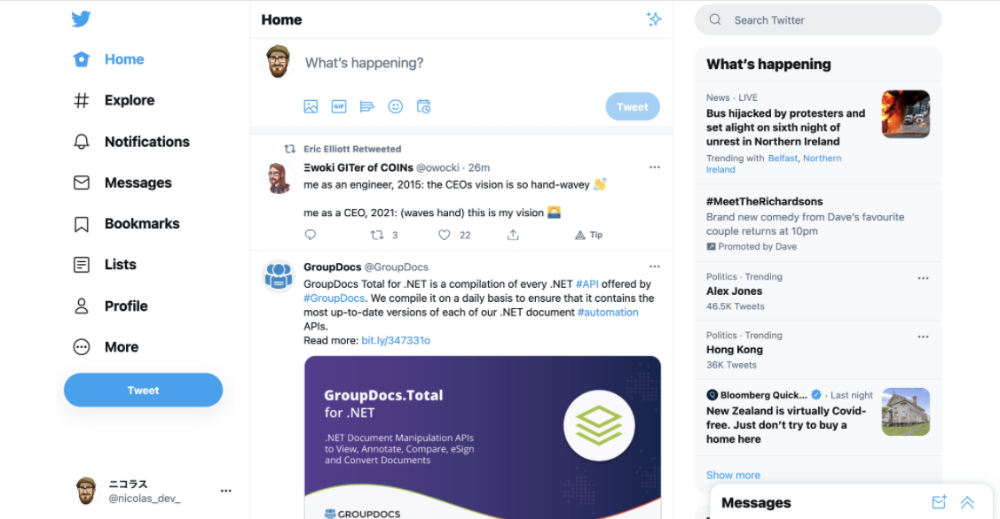
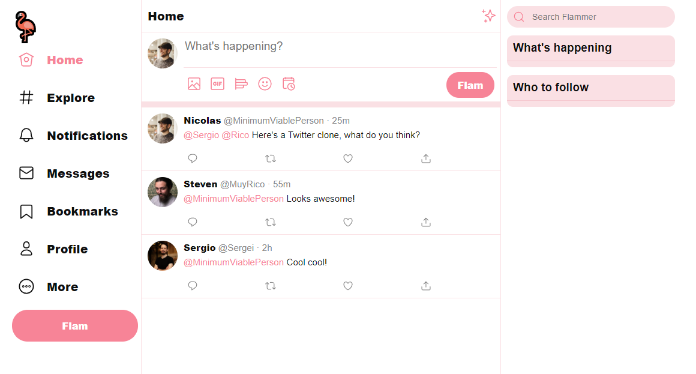

# Twitter Clone

For this exercise, we will be building a clone of Twitter:

This will put into practice everything we have learned so far about HTML & CSS. The below image shows an example of the level of detail you need to replicate from twitter:

## Instructions
- Add HTML elements
- Use CSS Grid for the layout and components
- Use CSS for styling
- You can use any image of your choice for the avatars
- Start *without* images and then add them later if you have time

**Tips**
- Breakdown the page into sections
- Work section by section until it looks good

## Assesment Criteria
* &#9745; Layout the main page elements (left-hand menu, tweet feed and right side-bar) using CSS Grid.
* &#9745; Define the page contents using properly structured HTML with appropriate elements
* &#9745; Use CSS Grid to layout the elements of individual components on the page, such as the tweets
* &#9745; Style the page using a mixture of CSS selectors types and combine selectors where appropriate to avoid duplication
* &#9745; Implement hover and selected state for the left-hand menu links.

### Extension Criteria
* &#9745; Make the layout responsive so that the side-bars are removed on lower resolution devices
* &#9745; Include images using the `img` and `svg` tags.
    * Get the source for the icon images from the Twitter website as SVG
    * Use a local file for the profile image 
    * Research how to use CSS to to make the profile image appear as a circle